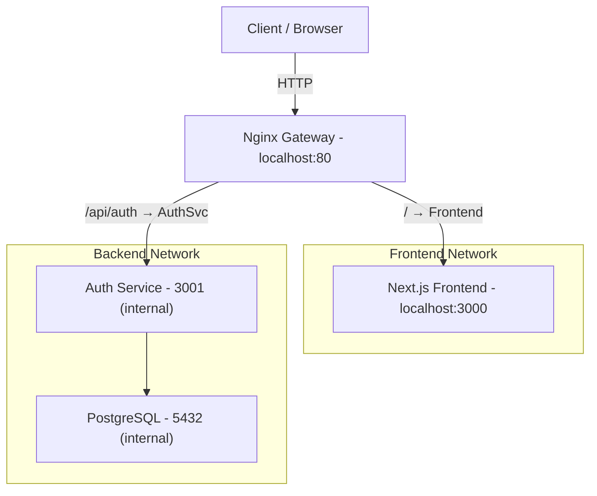

# Breezy Social Network

Twitter-like social network built with microservices architecture.

## Quick Start

### Prerequisites

- Docker & Docker Compose
- Node.js 24+ & pnpm 10.32.1
- Git

### Setup

```bash
# Clone and install dependencies
git clone <repo>
cd breezy-scoial-network
pnpm install
```

## Development

### With Docker (Recommended)

All services run in containers with hot-reload via code bind-mounts.

```bash
# Start all services (frontend, auth-svc, postgres, nginx)
docker compose up

# Start in background
docker compose up -d

# View logs
docker compose logs -f [service-name]

# Stop all services
docker compose down

# Rebuild images
docker compose build --no-cache
```

**Services & Ports:**

- **Frontend**: <http://localhost:3000>
- **Nginx Gateway**: <http://localhost>
- **Auth Service**: <http://localhost/api/auth/*> (via Nginx gateway)
- **PostgreSQL**: Internal only (not exposed)
- **Note**: Other services (user, post, notif, feed) are not yet included in the dev docker-compose

### Without Docker (Local Development)

Run each service locally in separate terminals:

```bash
# Terminal 1: Start databases
docker compose up -d postgres mongodb

# Terminal 2: Auth Service
pnpm --filter auth-svc dev

# Terminal 3: User Service
pnpm --filter user-svc dev

# Terminal 4: Post Service
pnpm --filter post-svc dev

# ... and so on for other services
```

## Production

### Environment Setup

1. Copy `.env.prod.example` to `.env.prod`
2. Update all `CHANGE_ME_*` values with secure secrets
3. Update `NEXT_PUBLIC_API_URL` to your domain

```bash
cp .env.prod.example .env.prod
# Edit .env.prod with your production secrets
```

### Deploy

```bash
# Build and start all services
pnpm docker:prod

# Verify all services are running
docker compose -f docker-compose.prod.yml ps
```

## Architecture

### Service & Network Layout (Development)

Current dev setup includes:



**Full Architecture** (reference — not all services deployed yet):

The complete architecture includes:
- `user-svc` (PostgreSQL) — User profiles & follows
- `post-svc` (MongoDB) — Posts & comments
- `notif-svc` (MongoDB) — Notifications
- `feed-svc` (stateless) — Feed calculation (fan-out on read)

**Networks:**

- `backend-network`: Services & databases (isolated from frontend)
- `frontend-network`: Frontend only (public-facing)
- Nginx bridges both networks for routing

## Configuration Files

- `.env` — Development variables
- `.env.prod` — Production secrets (not committed)
- `.env.example` — Template for development
- `.env.prod.example` — Template for production
- `docker-compose.yml` — Development setup
- `docker-compose.prod.yml` — Production setup

## Useful Commands

```bash
# Clean up Docker resources
docker compose down --volumes

# Rebuild images
docker compose build --no-cache

# Run a single service
docker compose --profile auth up -d

# Check service health
docker compose ps

# Access service logs
docker compose logs -f [service-name]
```

## Project Structure

```
breezy-scoial-network/
├── microservices/
│   ├── auth-svc/          # Authentication & JWT
│   ├── user-svc/          # User profiles & follows
│   ├── post-svc/          # Posts & comments (MongoDB)
│   ├── notif-svc/         # Notifications (MongoDB)
│   └── feed-svc/          # Feed (stateless, fan-out on read)
├── front/                 # Next.js frontend
├── gateway/               # Nginx reverse proxy
├── docker-compose.yml     # Dev setup
├── docker-compose.prod.yml # Prod setup
└── Dockerfile             # Multi-stage build for all services
```

## Notes

- **Hot-reload in dev**: Code changes in `src/` folders automatically reload
- **Profiling**: Use Docker Compose profiles to run only needed services
- **Database per service**: Each service has its own isolated database
- **Nginx routing**: All API requests go through Nginx gateway
